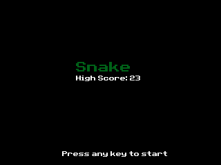
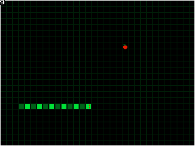
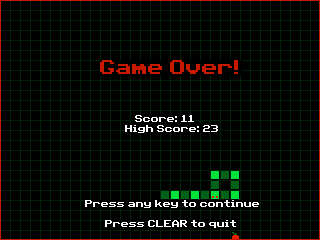

# TI-84 Calculator Snake Game in C

Simple Snake Game written in C cause I was bored. This project uses the [TI-84 Toolchain](https://github.com/CE-Programming/toolchain) libaries and compiler tool. I also use [CEmu](https://github.com/CE-Programming/CEmu) to easily test and debug the code. This program has also been tested on an real TI-84 Plus CE Python Edition that I own. Some examples of what the game looks like can be found below:

The game does store your high score in memory so when you reload the game you can challenge yourself to beat it. I spent all of like 3 hours working on this so it is crude but functional so have fun!

## Building the game from source
This will be updated at some point, no guarantees
